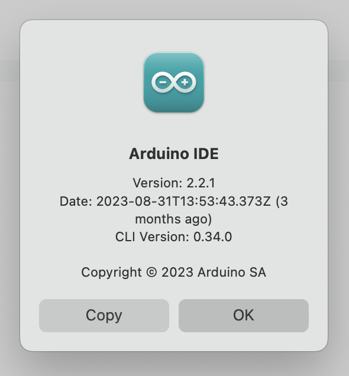
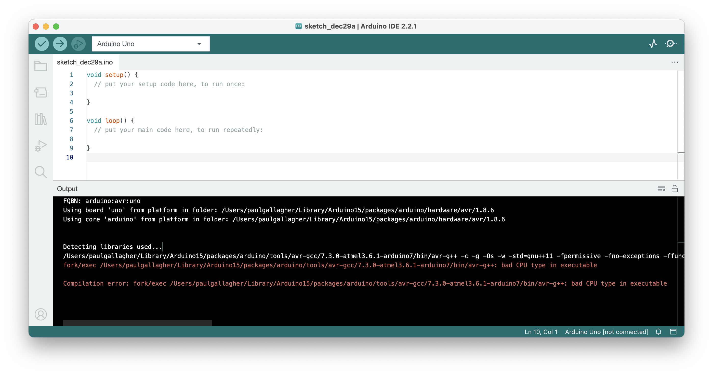
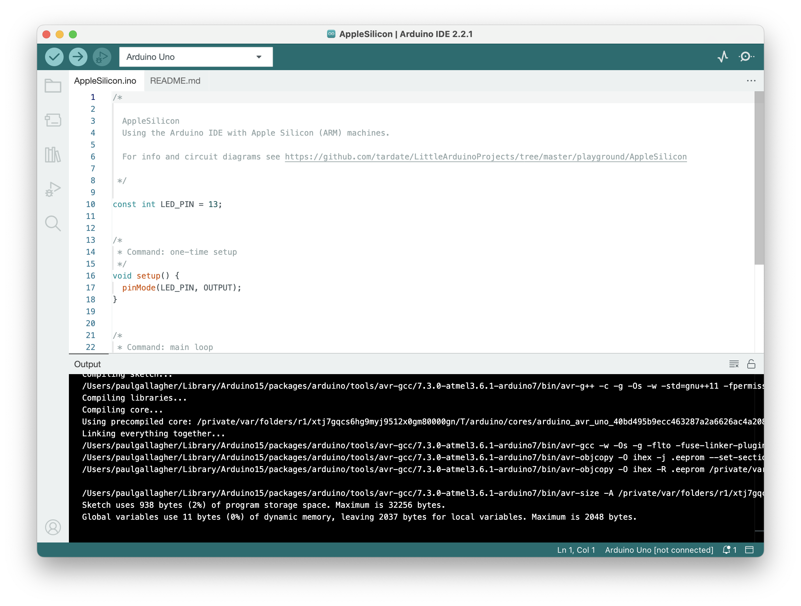

# #634 Arduino on Apple Silicon

Using the Arduino IDE with Apple Silicon (ARM) machines.

## Notes

Apple no longer produces x86 architecture Macs, using instead its own ARM-based Apple Silicon chips (M1, M2, M3). Just is a real pain since so many developer tools are specific for x86 architecture CPUs.

The [Arduino IDE](https://www.arduino.cc/en/software) is available in a native macOS Apple Silicon build. I'm currently using Version: 2.2.1 on a machine with and Apple M3 chip.

    Version: 2.2.1
    Date: 2023-08-31T13:53:43.373Z
    CLI Version: 0.34.0

### First Compilation

But compilation fails. The avr-gcc toolchain is still only shipped as x86-compatible. As of Q4 2023, we are still waiting for an update.

    Compilation error: fork/exec /Users/paulgallagher/Library/Arduino15/packages/arduino/tools/avr-gcc/7.3.0-atmel3.6.1-arduino7/bin/avr-g++: bad CPU type in executable

### Install Rosetta and Retry

As far as I can tell after a bit of googling is that currently the only way to resolve this issue is to use rosetta - Apple's compatibility layer.

Install rosetta:

    $ softwareupdate --install-rosetta
    I have read and agree to the terms of the software license agreement. A list of Apple SLAs may be found here: https://www.apple.com/legal/sla/
    Type A and press return to agree: A
    2023-12-29 16:19:35.536 softwareupdate[6713:179754] Package Authoring Error: 052-22577: Package reference com.apple.pkg.RosettaUpdateAuto is missing installKBytes attribute
    Install of Rosetta 2 finished successfully

And now we can compile successfully:

### Circuit Design

The latest [Fritzing](https://fritzing.org/releases) release (1.0.1) also works perfectly as a native application on Apple Silicon. I used it to draw the simple diagram of the blink sketch used for this test:

### Programming an Uno

The next test: will my Arduino be recognised as a device from macOS?

I plugged in an Arduino Uno R3 (using a USB-C to USB-A adapter) and it was recognised immediately and programming working without an issue:

I was also able to program an Arduino Mega 2560.

However I've run into an issue with Arduino Nano and also my collection of USB to serial adapters that use the CH340G chip. It is not recognised natively and so I'll need an updated driver.... and yes, I can now confirm I got it working; see [AppleSilicon/CH340](./CH340) for details.

## Credits and References

* [Arduino IDE](https://www.arduino.cc/en/software)
* [IDE 2.0.4 Apple Silicon install contains Intel architecture avr-g++](https://forum.arduino.cc/t/ide-2-0-4-apple-silicon-install-contains-intel-architecture-avr-g/1108160)
* [24" mac, M1: bad CPU type in executable](https://forum.arduino.cc/t/24-mac-m1-bad-cpu-type-in-executable/1071674/7)
* [How To Install Rosetta On M1, M2 & M3 Macs](https://machow2.com/rosetta-mac/)
