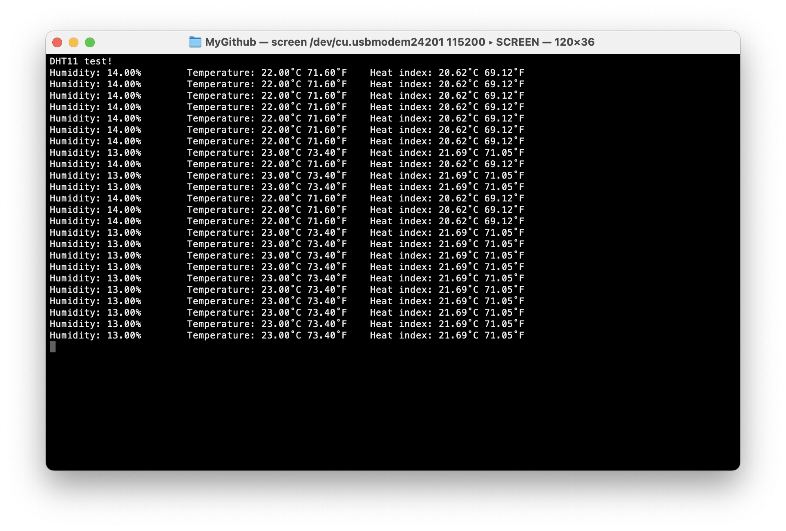

# #815 DHT11 Sensor Library Test

Logging temperature and humidity with DHT11 sensor. Uses the Adafruit Arduino DHT Sensor Library directly.


## Notes

This is a test of the DHT11 with the Adafruit DHT Sensor Library directly (without the unified sensor framework).

See [LEAP#816 DHT11 Unified Sensor Library Test](../UnifiedSensorTest/)
for a variation that uses the Adafruit unified sensor framework.

See [LEAP#301 DHT11 Basics](../Basics/) for an introduction to the DHT11 sensor.

### Circuit Design

I am using a DHT11 that is mounted on an adapter board that includes pull-up resistor for the data line, and a decoupling capacitor,
similar to ["New Temperature and Relative Humidity Sensor DHT11 Module with Cable for arduino Diy Kit" (aliexpress seller listing)](https://www.aliexpress.com/item/32997407491.html).


The schematic below shows the relevant components if a mounting module is not used.
Designed with Fritzing: see [Tester.fzz](./Tester.fzz).


### Demonstration Script

The DHT11 uses a single-wire two-way communications protocol.

The [Tester.ino](./Tester.ino) sketch simply outputs current readings to the console.

Requires the following Arduino libraries:

* [DHT Sensor Library](https://github.com/adafruit/DHT-sensor-library)

It is based on the `DHTtester.ino` example.

```c
#include "DHT.h"

const int DHT_PIN = 2;
const int DHT_TYPE = DHT11;
const int DELAY = 2000;

DHT dht(DHT_PIN, DHT_TYPE);

void setup() {
  Serial.begin(115200);
  Serial.println("DHT11 test!");

  dht.begin();
}

void loop() {
  delay(DELAY);

  float humidity = dht.readHumidity();
  float temp_c = dht.readTemperature();
  float temp_f = dht.readTemperature(true);

  if (isnan(humidity) || isnan(temp_c) || isnan(temp_f)) {
    Serial.println("Failed to read from DHT sensor!");
    return;
  }

  float heat_index_c = dht.computeHeatIndex(temp_c, humidity, false);
  float heat_index_f = dht.computeHeatIndex(temp_f, humidity);

  Serial.print("Humidity: ");
  Serial.print(humidity);
  Serial.print("%\t");
  Serial.print("Temperature: ");
  Serial.print(temp_c);
  Serial.print("˚C ");
  Serial.print(temp_f);
  Serial.print("˚F\t");
  Serial.print("Heat index: ");
  Serial.print(heat_index_c);
  Serial.print("˚C ");
  Serial.print(heat_index_f);
  Serial.println("˚F");
}
```

Sample console output:



## Credits and References

* [Arduino library for DHT11, DHT22, etc Temp & Humidity Sensors](https://github.com/adafruit/DHT-sensor-library)
* ["DHTxx Sensors Guide" (adafruit)](https://cdn-learn.adafruit.com/downloads/pdf/dht.pdf)
* ["New Temperature and Relative Humidity Sensor DHT11 Module with Cable for arduino Diy Kit" (aliexpress seller listing)](https://www.aliexpress.com/item/32997407491.html)
* ["DHT11 Humidity & Temperature Sensor" datasheet (mouser.com)](https://www.mouser.com/datasheet/2/758/DHT11-Technical-Data-Sheet-Translated-Version-1143054.pdf)
