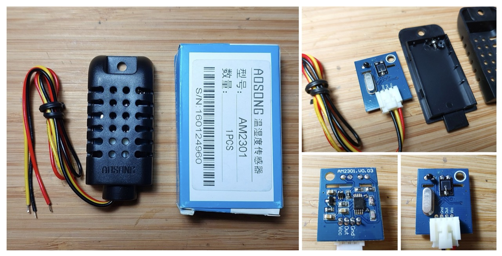
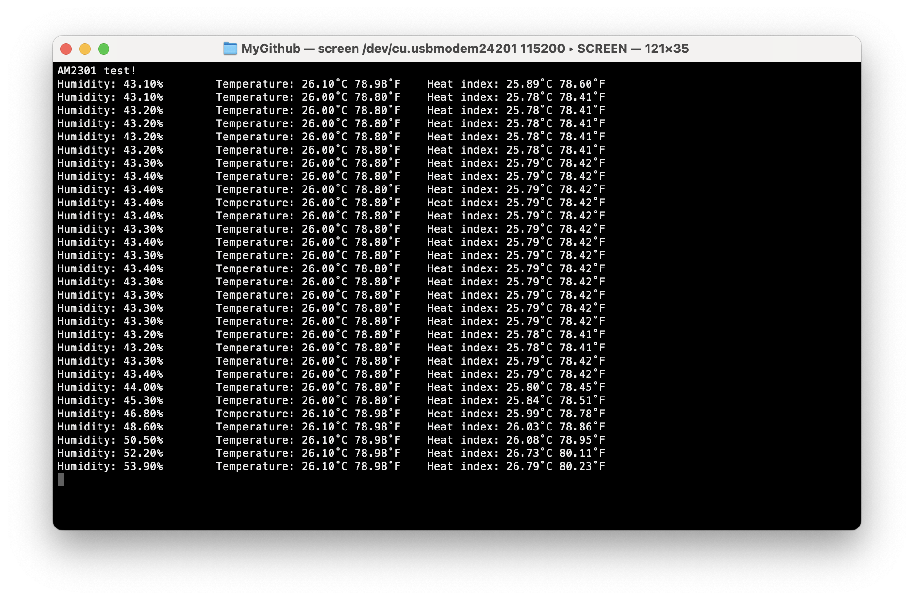

# #817 DHT21 Sensor Library Test

Logging temperature and humidity with an Aosong AM2301 DHT21-compatible sensor. Uses the Adafruit Arduino DHT Sensor Library directly.


## Notes

This is a test of the DHT21 with the Adafruit DHT Sensor Library directly (without the unified sensor framework).

I most recently purchased an AM2301 for SG$2.97 (Jan-2026):
["1-10PCS DHT21 Digital-output Relative Humidity & Temperature Sensor/Module,Connect With Single-bus-line Sensor AM2301 AM2301A" (aliexpress seller listing)](https://www.aliexpress.com/item/1005009549581458.html).

### About the Aosong AM2301 DHT21 sensor

The AM2301 is a DHT21-compatible temperature and humidity sensor.
Key specifications:

* temperature: -40-80°C ±0.3°C, 0.1°C resolution
* relative humidity: 0-99% ±3%, 0.1% resolution
* supply voltage range 3.3V - 5.2V, recommended supply voltage is 5V



### Circuit Design

Designed with Fritzing: see [Tester.fzz](./Tester.fzz).


### Demonstration Script

The DHT11 uses a single-wire two-way communications protocol.

The [Tester.ino](./Tester.ino) sketch simply outputs current readings to the console.

Requires the following Arduino libraries:

* [DHT Sensor Library](https://github.com/adafruit/DHT-sensor-library)

It is based on the `DHTtester.ino` example.

```c
#include "DHT.h"

const int DHT_PIN = 2;
const int DHT_TYPE = AM2301;
const int DELAY = 2000;

DHT dht(DHT_PIN, DHT_TYPE);


/*
 * Command: one-time setup
 */
void setup() {
  Serial.begin(115200);
  Serial.println("AM2301 test!");

  dht.begin();
}


/*
 * Command: main loop
 */
void loop() {
  delay(DELAY);

  float humidity = dht.readHumidity();
  float temp_c = dht.readTemperature();
  float temp_f = dht.readTemperature(true);

  if (isnan(humidity) || isnan(temp_c) || isnan(temp_f)) {
    Serial.println("Failed to read from DHT sensor!");
    return;
  }

  float heat_index_c = dht.computeHeatIndex(temp_c, humidity, false);
  float heat_index_f = dht.computeHeatIndex(temp_f, humidity);

  Serial.print("Humidity: ");
  Serial.print(humidity);
  Serial.print("%\t");
  Serial.print("Temperature: ");
  Serial.print(temp_c);
  Serial.print("˚C ");
  Serial.print(temp_f);
  Serial.print("˚F\t");
  Serial.print("Heat index: ");
  Serial.print(heat_index_c);
  Serial.print("˚C ");
  Serial.print(heat_index_f);
  Serial.println("˚F");
}
```

### Test Results

Sample console output collected with `screen`:

```sh
screen /dev/cu.usbmodem24201 115200
```



NOTE: The first sensor I used was consistently returning a 5.0% humidity reading no matter what the actual humidity was.
I confirmed it was a faulty device. The readings shown above were from a new device that is reporting humidity and temperature correctly.

## Credits and References

* ["AM2301 DHT21 Capacitance Digital Temperature & Humidity Sensor Replace SHT11 SHT15 free shipping 68" (aliexpress seller listing)](https://www.aliexpress.com/item/32265429028.html)
    * Originally purchased for US $2.89 (Mar-2016). Currently no longer available from this seller.
* ["1-10PCS DHT21 Digital-output Relative Humidity & Temperature Sensor/Module,Connect With Single-bus-line Sensor AM2301 AM2301A" (aliexpress seller listing)](https://www.aliexpress.com/item/1005009549581458.html)
    * Replacement AM2301 purchased for SG$2.97 (Jan-2026)
* [AM2301 datasheet (haoyuelectronics)](https://www.haoyuelectronics.com/Attachment/AM2301/AM2301.pdf)
* [ASAIR AM2301 Temperature and Humidity Sensor Modules (aosong)](https://www.aosong.com/en/Products/info.aspx?itemid=2301&lcid=139)
* <https://www.aosong.com/>
