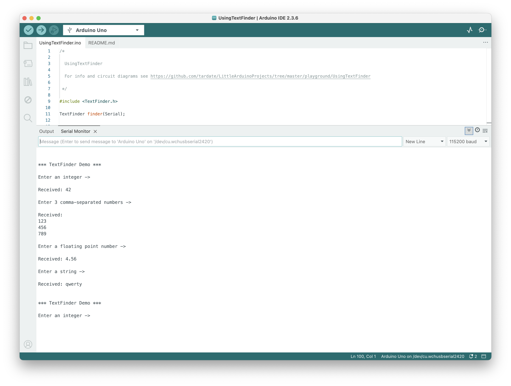

# #xxx Using TextFinder

Using the TextFinder library to extract fields from a string with an Arduino.

## Notes

The TextFinder library was originally posted by Michael Margolis on the old <http://playground.arduino.cc/Code/TextFinder>,
and discussed in the [Arduino Cookbook](../../books/arduino-cookbook/).

A copy of the code is now hosted and maintained on [GitHub](https://github.com/tardate/TextFinder).

### About TextFinder

TextFinder is a library for extracting information from a stream of data. It was created to be used with the Arduino Ethernet library to find particular fields and get strings or numeric values. I can also be used with Serial data.

For more examples of its use, see:

* [TextFinder Library examples](https://github.com/tardate/TextFinder/tree/master/Examples)
* [LEAP#018 FretBoard](../../FretBoard/) - for it's use parsing data from a web page

### Serial Example

The [UsingTextFinder.ino](./UsingTextFinder.ino) sketch demonstrates the basic usage of TextFinder with serial data:

* reading an integer
* reading comma-separated list of integers
* reading a floating point number
* reading a string

## Credits and References

* [Arduino reference: Serial](https://docs.arduino.cc/language-reference/en/functions/communication/serial/)
* [Arduino Cookbook: 4.5 Receiving Multiple Text Fields in a Single Message in Arduino](../../books/arduino-cookbook/)
* [TextFinder Library](https://github.com/tardate/TextFinder) - a port of the original source
